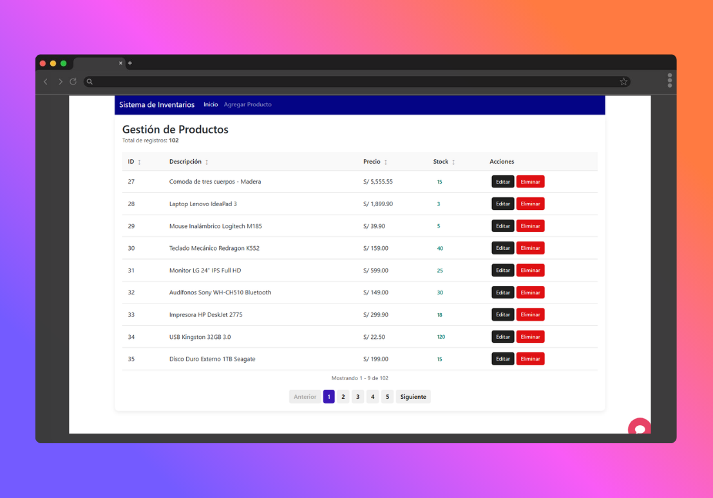
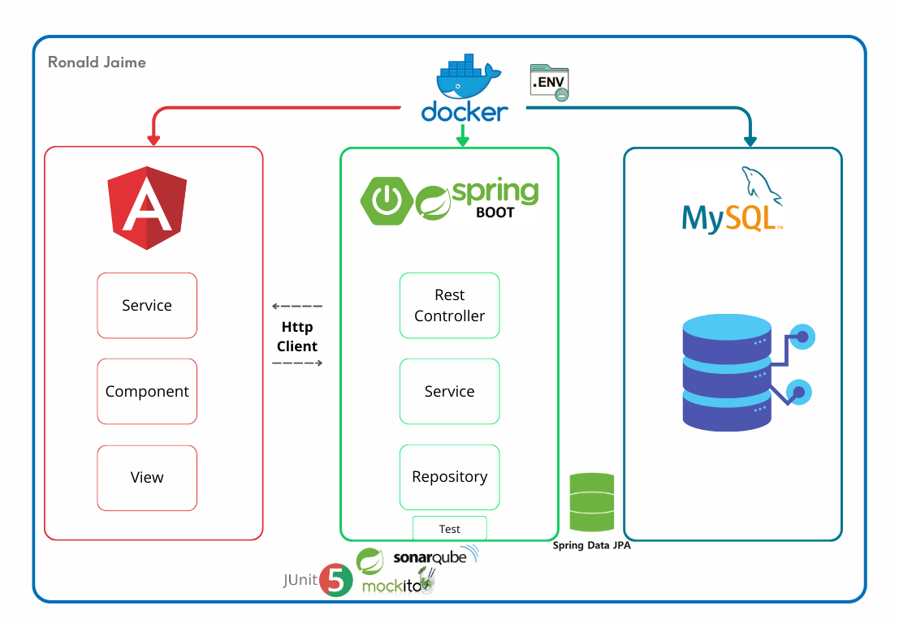

# Inventarios Angular

Un sistema de gestión de inventarios full-stack construido con Angular para el frontend y Spring Boot para el backend, containerizado usando Docker Compose.

## Descripción General

Esta aplicación proporciona una solución completa para gestionar inventarios de productos. Cuenta con una interfaz web responsiva para realizar operaciones CRUD en productos, con un backend robusto de API REST que maneja la persistencia de datos y validación.



## Estructura del Proyecto

```
inventarios_angular/
├── docker-compose.yml
├── inventario-app/
│   ├── angular.json
│   ├── dockerfile
│   ├── nginx.conf
│   ├── package.json
│   ├── README.md
│   ├── tsconfig.app.json
│   ├── tsconfig.json
│   ├── tsconfig.spec.json
│   ├── public/
│   │   └── favicon.ico
│   ├── src/
│   │   ├── index.html
│   │   ├── main.ts
│   │   ├── styles.css
│   │   └── app/
│   │       ├── app.config.ts
│   │       ├── app.css
│   │       ├── app.html
│   │       ├── app.routes.ts
│   │       ├── app.spec.ts
│   │       ├── app.ts
│   │       ├── agregar-producto/
│   │       ├── editar-producto/
│   │       ├── interfaces/
│   │       ├── models/
│   │       ├── producto-lista/
│   │       └── servicios/
│   └── environments/
├── inventarios/
│   ├── Dockerfile
│   ├── HELP.md
│   ├── mvnw
│   ├── mvnw.cmd
│   ├── pom.xml
│   └── src/
│       ├── main/
│       │   ├── java/
│       │   │   └── gm/
│       │   │       └── inventarios/
│       │   │           ├── InventariosApplication.java
│       │   │           ├── controller/
│       │   │           ├── exception/
│       │   │           ├── mapper/
│       │   │           ├── model/
│       │   │           ├── repository/
│       │   │           └── service/
│       │   └── resources/
│       │       ├── application.yml
│       │       ├── data.sql
│       │       └── static/
│       └── test/
│           └── java/
│               └── gm/
│                   └── inventarios/
└── README.md
```

## Arquitectura - Diagrama



## Características

- **Gestión de Productos**: Crear, leer, actualizar y eliminar productos
- **Paginación**: Manejo eficiente de listas grandes de productos con paginación del lado del servidor
- **Validación de Datos**: Validación completa tanto en frontend como en backend
- **Diseño Responsivo**: Interfaz moderna y amigable que funciona en escritorio y dispositivos móviles
- **API RESTful**: Endpoints de API bien estructurados siguiendo principios REST
- **Integración con Base de Datos**: Almacenamiento persistente usando base de datos MySQL
- **Containerización**: Despliegue fácil usando Docker y Docker Compose

## Stack Tecnológico

### Backend
- **Java 17**
- **Spring Boot 3.5.3**
- **Spring Data JPA** para acceso a datos
- **Spring Web** para API REST
- **Spring Validation** para validación de entrada
- **MySQL 8** como base de datos
- **Lombok** para reducir código boilerplate
- **MapStruct** para mapeo de objetos
- **Maven** para gestión de dependencias

### Frontend
- **Angular 20**
- **TypeScript**
- **RxJS** para programación reactiva
- **Angular CLI** para scaffolding del proyecto

### Infraestructura
- **Docker** para containerización
- **Docker Compose** para orquestación
- **Nginx** como proxy reverso para el frontend

## Prerrequisitos

Antes de ejecutar esta aplicación, asegúrese de tener instalados los siguientes elementos:

- Docker y Docker Compose
- Git (opcional, para clonar el repositorio)

## Instalación y Configuración

1. **Clonar el repositorio** (si aplica):
   ```bash
   git clone <url-del-repositorio>
   cd inventarios_angular
   ```

2. **Crear archivo de entorno**:
   Cree un archivo `.env` en el directorio raíz con las siguientes variables:
   ```env
   MYSQL_DATABASE=inventarios_db
   MYSQL_USER=inventarios_user
   MYSQL_PASSWORD=inventarios_password
   MYSQL_ROOT_PASSWORD=root_password
   SPRING_DATASOURCE_URL=jdbc:mysql://mysql:3306/inventarios_db?createDatabaseIfNotExist=true
   SPRING_DATASOURCE_USERNAME=inventarios_user
   SPRING_DATASOURCE_PASSWORD=inventarios_password
   ```

3. **Construir y ejecutar la aplicación**:
   ```bash
   docker-compose up --build
   ```

4. **Acceder a la aplicación**:
   - Frontend: http://localhost
   - API Backend: http://localhost:8080

## Endpoints de la API

La API REST proporciona los siguientes endpoints:

- `GET /inventario-app/productos` - Obtener lista paginada de productos
- `GET /inventario-app/productos/{id}` - Obtener un producto específico por ID
- `POST /inventario-app/productos` - Crear un nuevo producto
- `PUT /inventario-app/productos/{id}` - Actualizar un producto existente
- `DELETE /inventario-app/productos/{id}` - Eliminar un producto

### Estructura de Datos del Producto

```json
{
  "idProducto": 1,
  "descripcion": "Descripción del producto",
  "precio": 29.99,
  "existencia": 100
}
```

## Desarrollo

### Desarrollo del Backend

1. Navegar al directorio del backend:
   ```bash
   cd inventarios
   ```

2. Ejecutar la aplicación:
   ```bash
   ./mvnw spring-boot:run
   ```

3. El backend estará disponible en http://localhost:8080

### Desarrollo del Frontend

1. Navegar al directorio del frontend:
   ```bash
   cd inventario-app
   ```

2. Instalar dependencias:
   ```bash
   npm install
   ```

3. Iniciar el servidor de desarrollo:
   ```bash
   npm start
   ```

4. El frontend estará disponible en http://localhost:4200

## Pruebas

El proyecto incluye pruebas unitarias para los controladores y servicios del backend, con Junit, Mockito y analizado en Sonarqube, así como pruebas del frontend con Karma y Jasmine.

### Pruebas del Backend
```bash
cd inventarios
./mvnw test
```

### Pruebas del Frontend
```bash
cd inventario-app
npm test
```

## Construcción para Producción

### Backend
```bash
cd inventarios
./mvnw clean package
```

### Frontend
```bash
cd inventario-app
npm run build
```

## Comandos de Docker

- **Iniciar servicios**: `docker-compose up`
- **Iniciar en segundo plano**: `docker-compose up -d`
- **Detener servicios**: `docker-compose down`
- **Reconstruir e iniciar**: `docker-compose up --build`
- **Ver logs**: `docker-compose logs`
- **Ver logs de servicio específico**: `docker-compose logs backend`

## Configuración

### Configuración de Base de Datos
La aplicación usa MySQL como base de datos. La configuración se maneja a través de variables de entorno en la configuración de Docker Compose.

### Configuración de CORS
El backend está configurado para permitir solicitudes desde `http://localhost` y `http://localhost:80` para desarrollo y producción respectivamente.

## Contribución

1. Hacer fork del repositorio
2. Crear una rama de características (`git checkout -b feature/CaracteristicaIncreible`)
3. Confirmar los cambios (`git commit -m 'Agregar alguna CaracteristicaIncreible'`)
4. Hacer push a la rama (`git push origin feature/CaracteristicaIncreible`)
5. Abrir un Pull Request

